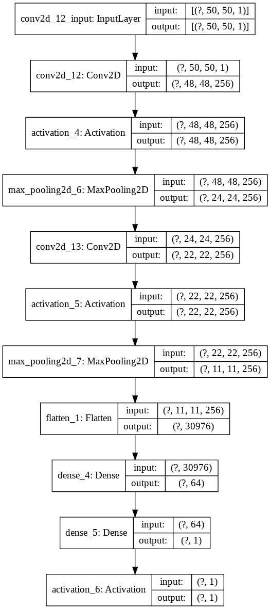

# Cat-Or-Dog-Recognizer-Web-App-DL-streamlit
It's my first try for a full stack development! For front end I have used streamlit
# Introduction
It is a web application where one user can test their images to predict whether the image is a dog or a cat! The model has the power to predict image of Cats and Dogs only, so you are requested to give image of a Cat Or a Dog, unless useless prediction can be done!!!
# Features
First of all,
- You have to upload your own test images to test it!!!
- Or, if you are too much lazy (😎, like me!), then also no problem, I already selected some test images for you, you have to just go to that section & click the ⬇️ Download button to download those pictures!
I have done a lot of error handling to make the app perfect!
# See The Web Appication In Action!
If you want to see the web application in action, then click the image below!

# Behind The Scene
Behide the scene there is a CNN model, it's pretty straight forward model, as my aim was to build a full stack, so I was not bother about the accuracy, though the rough model already gives aroung **80%** accuracy on the validation data, which was made by 30% splitting of training data, it's quite well for a base model!
The model architechture is given below:

# Conclusion
I have tried to deploy it on heroku, but it exceeds the slug size! I am looking for an alternative way to depoly the whole work, if I get success, then I will put the link on this readme.md file!
Thank you!
